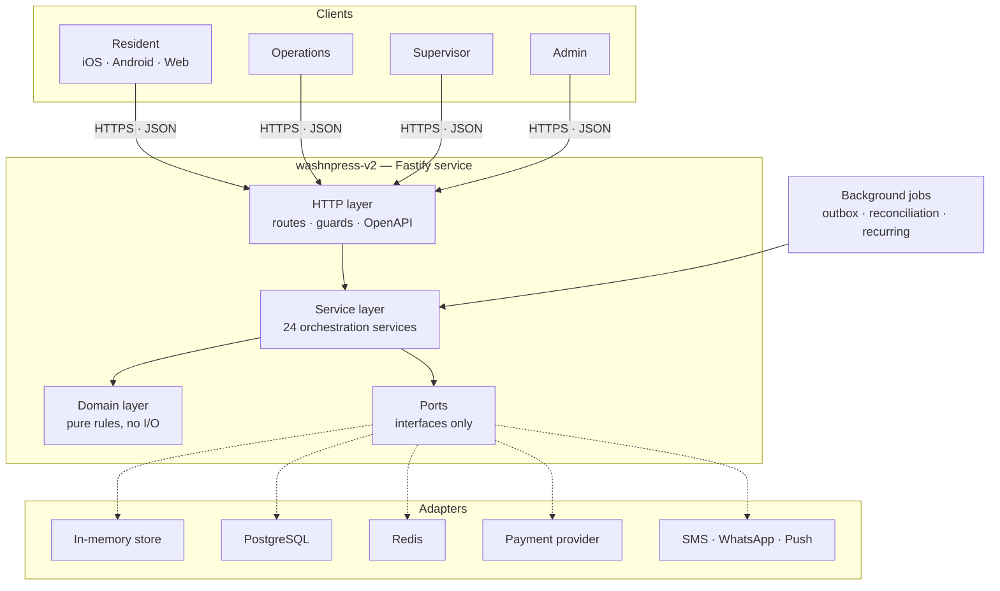
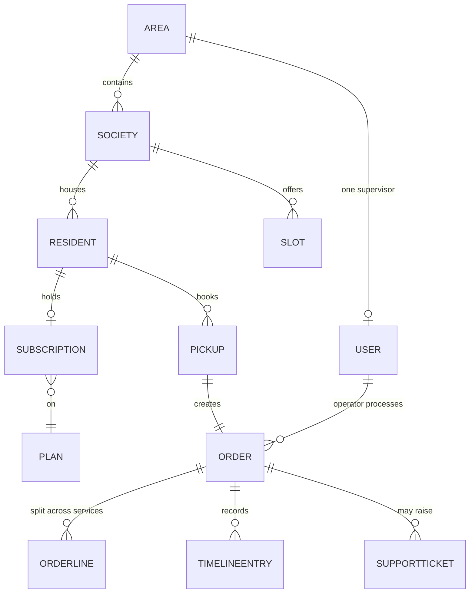
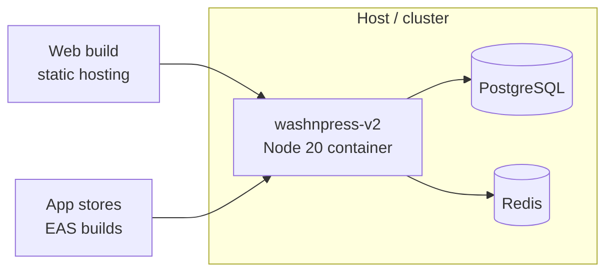

# Wash N Press — High Level Design

| | |
| --- | --- |
| System | Wash N Press — subscription laundry for residential societies |
| Repository | `github.com/Tadipartirohith/WashNPress` |
| Components | `washnpress-v2` (backend service), `washnpress-mobile` (client) |
| Document | High Level Design |
| Companion documents | [SLD.md](SLD.md) — system level design · [LLD.md](LLD.md) — low level design |

---

## 1. Purpose and scope

This document describes **how the Wash N Press platform is put together**: its major
components, the boundaries between them, the technology each is built on, and the
decisions that shaped those choices.

It covers the backend service and the client application. It does not cover the
business rules in detail — those are in the [LLD](LLD.md) — nor the end-to-end
business flows, which are in the [SLD](SLD.md).

## 2. What the system does

A residential society signs up. Its residents book laundry pickups, either on a
monthly subscription with a garment allowance or paying per garment as they go.
Operations staff collect the garments, process each one according to the service it
was sent for, check the quality and deliver them back. Supervisors run an operational
area; an admin runs the platform.

Four things about the domain shape every design decision that follows:

1. **Custody of physical goods.** Garments leave a resident's home and come back. The
   count must reconcile, and any discrepancy must be recorded rather than absorbed.
2. **Money.** Subscriptions, per garment charges, wallets and refunds. Every rupee
   movement has to be explainable after the fact.
3. **A strict visibility boundary.** A supervisor may see their own area and nothing
   else. This is a correctness requirement, not a UI convenience.
4. **Nobody is a single point of failure.** Staff go on leave; areas outlive their
   supervisors; work in progress must never become unreachable.

## 3. Architecture at a glance



The service is a **single deployable process**. Background jobs run inside it on
timers rather than as separate workers, because the workload does not justify the
operational cost of separating them and doing so would introduce a coordination
problem the system does not currently have.

## 4. Layering, and why

The backend is layered so that **business rules do not depend on infrastructure**.

| Layer | Location | Depends on | May do I/O |
| --- | --- | --- | --- |
| Domain | `src/domain/` | nothing | **No** |
| Ports | `src/ports/` | domain types | — (interfaces) |
| Services | `src/services/` | domain, ports | via ports only |
| Adapters | `src/adapters/` | ports | Yes |
| HTTP | `src/app/` | services | Yes |

**The domain layer is pure.** `order-state-machine.ts`, `pricing.ts`,
`processing.ts`, `garments.ts`, `ledger.ts` and `access.ts` are functions over data.
They have no database, no clock they did not receive, and no framework. That is what
makes the rules testable in isolation and reviewable without tracing through
infrastructure.

**Services orchestrate.** They read through a port, apply a domain rule, write back,
and emit notifications and audit entries. They are where a use case lives.

**Adapters are swappable.** The `DataStore` port has an in-memory implementation and
a PostgreSQL one, and the whole suite runs against both. Nothing above the port knows
which is in use.

### Why not a heavier architecture

The system does not use CQRS, event sourcing, or a message broker. The write volume
is a few hundred orders a day per area; the read model is the write model; the
consistency requirements are satisfied by a single relational database. Introducing
those patterns would add failure modes without removing any.

## 5. Technology choices

| Concern | Choice | Why |
| --- | --- | --- |
| Runtime | Node 20, TypeScript (strict) | One language across service and client; the type system carries the domain model |
| HTTP | Fastify 5 | Fast, schema-first, and its lifecycle hooks let OpenAPI be generated from the routes actually registered |
| Validation | Zod | Parses at the boundary; a validated request body is a typed value |
| Persistence | PostgreSQL, JSONB documents + relational ledger | See §6 |
| Cache / rate limiting | Redis, or in-memory | Redis when horizontal scale is wanted; in-memory for a single node or local work |
| Client | Expo / React Native | One codebase for iOS, Android and web; the web build is what makes the four portals demonstrable without app store distribution |
| Tests | Vitest, `app.inject`, `pg-mem` | Functional tests exercise the real app without a network port or a live database |

## 6. Data architecture

### The shape

Most entities are stored as **`(id TEXT PRIMARY KEY, doc JSONB)`**. The ledger is
**fully relational**. Slots carry two promoted columns.

This is deliberate:

- **Documents for aggregates.** An order, with its lines, timeline and quantities, is
  read and written as a whole. Splitting it across a dozen tables would buy nothing
  and cost a join on every read.
- **Relational for the ledger.** `ledger_txn` and `ledger_entry` are separate tables
  with real columns because money must be aggregated, and a double-entry balance
  check is a `SUM` over entries, not a document scan.
- **Promoted columns where atomicity is required.** `slots.capacity_remaining` and
  `slots.is_active` are real columns so that taking a slot is a single conditional
  `UPDATE` (see §8).

### Entities

Twenty-four entities in `src/domain/models.ts`, of which the load-bearing ones are:



An **Area** has exactly one responsible supervisor and may have none. That single
cardinality decision drives the whole visibility model: an operator's supervisor is
*derived* from their area rather than stored, so the two can never fall out of step,
and staff can be created before any supervisor exists.

## 7. Security and access control

### Authentication

Phone number → one-time password → session token. The token is returned in the
response body and also set as an `HttpOnly` cookie; either is accepted. Sessions are
stored server side and can be revoked, which is what makes "deactivating an account
ends its live sessions" true rather than aspirational.

OTP send is rate limited per phone number. Attempts are capped, and exceeding them
locks the number out for a configured period.

### Authorisation

Four roles: **resident**, **operator**, **supervisor**, **admin**.

The critical rule is the **area boundary**, and it is enforced in exactly one place —
`src/domain/access.ts` with `src/services/access-service.ts` — rather than per route:

- Scope is always derived from the **session**, never from a request parameter. A
  supervisor creating a society in another area cannot do so by sending a different
  `areaId`; the value is ignored and the session's area is used.
- A request for something outside scope gets the **same answer as a request for
  something that does not exist**, so the boundary does not leak existence.

This is the single most important structural decision in the system. Enforcing it
per route would guarantee that some route eventually forgets.

### Audit

Every administrative change is written to an audit log with the actor, the resource,
and the previous and new values.

## 8. Correctness mechanisms

Five mechanisms exist because the alternative is a class of bug that is expensive to
discover in production.

| Mechanism | Where | What it prevents |
| --- | --- | --- |
| **Double-entry ledger** | `domain/ledger.ts` | Money appearing or vanishing. Every transaction balances or it is rejected |
| **Explicit order state machine** | `domain/order-state-machine.ts` | An order reaching a state it should not. The UI asks for an action; the backend decides legality |
| **Atomic slot capacity** | `adapters/postgres` conditional `UPDATE` | Overselling a slot under concurrency. Two residents taking the last place cannot both succeed |
| **Verified, idempotent webhooks** | `services/payment-service.ts`, `processed_events` | A forged payment being credited, or a replayed one credited twice |
| **One scope resolver** | `domain/access.ts` | An endpoint forgetting the area boundary |

### Derived, never supplied

A related principle runs through the domain: **numbers that determine money are
derived by the backend and cannot be supplied by a client.** The operator enters only
the physically accepted garment quantity. The covered quantity, the additional
quantity, the rate and the charge are computed from it. Neither the operator nor the
resident can influence them.

## 9. Time

The operation runs on a **local service day**, not on UTC.
`scheduling.serviceDayOffsetMinutes` (default `+330`, India) drives one helper,
`serviceDay()`, and everything that turns a timestamp into a date goes through it.

This is called out at high level because getting it wrong is invisible in testing and
obvious in production: with the day computed in UTC, an operation in India finishes
its day at half past five the following morning, leaving yesterday's pickup slots
bookable through the small hours and silently shifting any report run early.

## 10. Integrations

| Integration | Adapter | Notes |
| --- | --- | --- |
| Payments | `razorpay-provider.ts`, `fake-provider.ts` | Webhook signature verified; events deduplicated by id |
| SMS / WhatsApp / Email / Push | `adapters/notifications/composite.ts` | Fan-out through one composite provider. Every channel is named; an unknown one is recorded rather than guessed at, because guessing is what once put email on the push provider |
| Observability | `observability/metrics.ts`, `tracing.ts` | Prometheus-style metrics; OTLP tracing when configured |

Outbound notifications use the **outbox pattern**: the service writes an event in the
same operation as the state change, and a background worker dispatches it. A provider
being unavailable delays a message; it never loses one and never blocks the order.

## 11. Background processing

Three jobs run on timers inside the service process:

| Job | Interval | Responsibility |
| --- | --- | --- |
| Outbox dispatch | `jobs.outboxIntervalSeconds` | Deliver queued notifications |
| Payment reconciliation | `jobs.reconciliationIntervalSeconds` | Settle intents the webhook did not confirm |
| Recurring generation | `jobs.recurringGenerationIntervalSeconds` | Create the next occurrence of a recurring pickup |

All three are idempotent, because a timer that fires twice must not do the work twice.

## 12. The client

One Expo / React Native codebase serves **four portals**. The portal that opens is
decided by the role on the session; the backend independently enforces the same
boundary, so the client only decides what is worth showing.

```
App.tsx              session restore, portal routing
src/api/             typed client and response types
src/portals/         Resident · Operations · Supervisor · Admin
src/components/      shared primitives, order and ticket views, calendar
src/offline/         action queue with replay
src/hooks.ts         loading, foreground polling, debounce
```

Two client-side decisions worth recording:

- **The offline queue.** An operator action that fails for want of connectivity is
  stored locally and replayed in order. Operations staff work in basements and
  stairwells; losing an action there is not acceptable.
- **Polling, not sockets.** Screens showing work in progress refresh on a timer while
  foregrounded. A socket layer would add a connection lifecycle to manage for a
  latency improvement nobody has asked for.

## 13. Deployment



- **Container**: multi-stage Docker build; the image is published to GHCR on every
  merge to `main`.
- **Compose profiles**: `lite` runs the service alone on in-memory storage; `full`
  brings up PostgreSQL and Redis alongside it.
- **Cloud**: an Azure Bicep template in `deployment/` provisions the autoscaling
  infrastructure.
- **Configuration**: files under `config/` layered with environment variables
  (`WNP_` prefixed, double underscore for nesting). No secret is committed.

## 14. Quality gates

Every push and pull request runs: type check, the full test suite, a production
build, a Docker image build, and an end-to-end smoke test against the built
container.

| Gate | Count |
| --- | --- |
| Unit and functional tests | 220 |
| Documented API operations | 169, across 147 paths |
| Smoke test checks against a live container | 58 |

Two properties are enforced mechanically rather than by convention:

- **No route may be undocumented.** OpenAPI is generated from the routes Fastify
  actually registered, and a test fails if one is missing. The documentation cannot
  drift from the implementation.
- **Both storage adapters must behave identically.** The suite runs against the
  in-memory store and against PostgreSQL via `pg-mem`.

## 15. Non-functional characteristics

| Attribute | Position |
| --- | --- |
| **Availability** | Stateless service; sessions and rate limits in Redis, so instances scale horizontally |
| **Consistency** | Strong, within a single PostgreSQL instance. No eventual consistency in the order or money paths |
| **Auditability** | Every administrative change and every rupee movement is recorded with its previous value |
| **Recoverability** | Staff are deactivated, never deleted; slots are cancelled, never deleted; services are retired, never deleted. Nothing in flight loses its history |
| **Observability** | Structured logs, metrics, optional OTLP tracing, `/health` and `/docs` |
| **Security** | Server-side sessions, rate limited OTP, signed webhooks, one scope resolver, no client-supplied money |

## 16. Known constraints

Recorded honestly rather than omitted:

- **Single database.** No read replica or sharding. Adequate for the current and
  projected volume; would need revisiting at national scale.
- **Jobs run in-process.** Multiple instances would each run the timers. The jobs are
  idempotent so this is safe, but it is duplicated work; a leader election or an
  external scheduler would be the fix.
- **Notification delivery is best-effort.** The outbox guarantees the attempt, not
  the receipt. There is no delivery-receipt reconciliation.
- **The web build is the demonstrable client.** Signed native builds and store
  distribution are configured (`eas.json`) but not part of this repository.

---

*Related: [SLD.md](SLD.md) for system context and end-to-end flows · [LLD.md](LLD.md)
for module, data and algorithm detail.*
