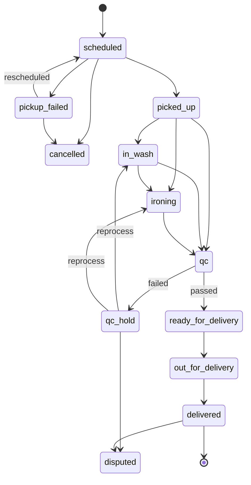

# Wash N Press — Low Level Design

| | |
| --- | --- |
| System | Wash N Press — subscription laundry for residential societies |
| Repository | `github.com/Tadipartirohith/WashNPress` |
| Document | Low Level Design |
| Companion documents | [SLD.md](SLD.md) — system level design · [HLD.md](HLD.md) — high level design |

---

## 1. Purpose

This document describes the **internals**: what each module is responsible for, how
the data is shaped, the algorithms that carry the business rules, and the contracts
between the pieces.

It is written to be read alongside the code. File paths are given for everything.

## 2. Source layout

```
washnpress-v2/
├── config/               all tunable values; layered with WNP_ env vars
├── db/init.sql           schema, mirrored from adapters/postgres/schema.ts
├── src/
│   ├── domain/           pure rules — no I/O, no framework, no clock it did not receive
│   ├── ports/            interfaces the rest of the code depends on
│   ├── adapters/         memory · postgres · cache · payments · notifications
│   ├── services/         orchestration; one file per use-case family
│   ├── app/              Fastify layer: routes, guards, OpenAPI generation
│   ├── jobs/             timer-driven background work
│   ├── observability/    metrics and tracing
│   └── seed.ts           demo data
└── test/
    ├── unit/             domain rules in isolation
    └── functional/       the real app over app.inject

washnpress-mobile/
└── src/
    ├── api/              typed client and response types
    ├── portals/          Resident · Operations · Supervisor · Admin
    ├── components/       ui · order · support · calendar
    ├── offline/          action queue with replay
    ├── screens/          login, onboarding, QR scanner
    └── hooks.ts          loading, foreground polling, debounce
```

**Sizes:** domain ~1,020 lines across 15 modules plus `payments/`; services ~3,483
across 24 files; HTTP routes ~2,723 across 14 files.

## 3. Domain layer

Pure functions over data. No module here performs I/O.

| Module | Responsibility |
| --- | --- |
| `models.ts` | Every entity type. The single source of truth for the data model |
| `order-state-machine.ts` | Legal transitions, QC and delivery guards, timeline rendering |
| `processing.ts` | What a batch has to go through, given the services its garments were sent for |
| `pricing.ts` | Order lines, per-category prices, plan coverage, the order charge |
| `garments.ts` | The covered / additional split and remaining allowance |
| `access.ts` | Role and area scope rules |
| `ledger.ts`, `accounts.ts`, `ledger-accounts.ts` | Double-entry transactions and the chart of accounts |
| `money.ts` | Paise arithmetic and guards |
| `subscriptions.ts` | Cycle pricing, proration, cycle length |
| `slots.ts` | Capacity reservation rules |
| `otp.ts` | Generation, expiry, attempt limits |
| `codes.ts` | Order codes and QR batch codes |
| `rate-limit.ts` | Fixed-window limiter |
| `payments/` | Webhook signature verification |

### 3.1 The order state machine

`src/domain/order-state-machine.ts`



`TRANSITIONS` states what is **structurally** legal. `domain/processing.ts` then
narrows it to what a given batch actually needs — the skip edges exist so an Iron Only
order can go straight to `ironing`, and a Wash Only order from `in_wash` to `qc`.

Two guards live in `transition()`:

- `ready_for_delivery` requires `qcPassed === true`.
- `delivered` with a pickup/delivery count mismatch requires a documented
  `discrepancyReason`.

### 3.2 Per-garment processing

`src/domain/processing.ts`

Each `GarmentService` declares what physically has to happen:

```ts
requiresClean: boolean          // does it need cleaning at all
cleanStage: "wash" | "dry_clean" | "premium"
requiresPress: boolean          // does it need ironing
```

An order's requirement is the **union** of its lines:

```ts
orderRequirement(lines) → {
  requiresClean: lines.some(l => l.requiresClean),
  cleanStage:    most specialised present — premium > dry_clean > wash,
  requiresPress: lines.some(l => l.requiresPress),
}
```

`allowedNext(state, requirement)` filters `TRANSITIONS[state]`:

| Target | Allowed when |
| --- | --- |
| `in_wash` | the batch needs cleaning |
| `ironing` | it needs pressing, and (from `picked_up`) needs no cleaning first |
| `qc` | from `picked_up`: needs neither. From `in_wash`: needs no pressing |

An order with **no recorded lines** — booked before per-line services existed — falls
back to the full wash-and-iron path, so nothing in flight can become unable to move.

`lifecycleFor(requirement)` produces the resident's timeline with the stages that
order skips left out entirely, rather than shown perpetually pending.

### 3.3 Pricing

`src/domain/pricing.ts`

Two independent price tables:

| Table | Lives on | Prices |
| --- | --- | --- |
| `garmentPricesPaise` | `SystemConfig` | The garment itself, per category, for a resident paying as they go |
| `pricesPaise` | each `GarmentService` | The service, per category |

Both fall back to a flat rate when a category has no entry
(`nonSubscriberGarmentRatePaise` and `service.unitPricePaise` respectively).

**Line construction** (`buildLines`) snapshots the service's processing flags and the
coverage decision onto the line at booking time, so a later catalogue change never
rewrites an order in flight.

**Order charge** (`priceOrder`):

```
if no subscription:
    garmentCharge = Σ over categories: quantity × garmentPrice(category)
    total         = garmentCharge + servicesPaise

if subscribed:
    eligible = min(accepted, garments booked for a covered service)
    covered  = min(eligible, remainingAllowance)
    additional = accepted − covered
    total    = additional × additionalRatePaise + servicesPaise
```

The key line is `eligible`: garments sent for a service the plan does **not** cover
cannot spend allowance. Sending everything for dry cleaning does not silently consume
a month of a plan that excludes it.

A plan stored before coverage existed (`coveredServiceIds` absent) is normalised to
cover the ordinary wash and iron, so nothing that used to be included starts being
charged for.

### 3.4 Access control

`src/domain/access.ts` + `src/services/access-service.ts`

```ts
scopeFor(session) → { role, areaId, societyIds, residentId }
allowsArea(scope, areaId): boolean
allowsSociety(scope, societyId): boolean
hasRole(session, role): boolean
```

Every scoped route calls `requireOrder`, `requireSociety` or `visibleSocietyIds` on
the access service. Two invariants:

- **Scope comes from the session.** An `areaId` in a request body is ignored where a
  session already implies one.
- **Out of scope is indistinguishable from absent.** `ForbiddenScopeError` maps to the
  same response shape as not-found, so the boundary does not leak existence.

### 3.5 The ledger

`src/domain/ledger.ts`

Every money movement is a transaction of balanced entries:

```ts
{ id, reference, createdAt, entries: [{ account, direction: "debit"|"credit", amount }] }
```

Construction rejects an unbalanced transaction. Balances are derived by summing
entries, never stored, so a balance cannot drift from its history.

## 4. Ports and adapters

`src/ports/repositories.ts` defines one `DataStore` with 21 collections and four
specialised repositories:

```ts
interface DataStore {
  users, areas, residents, societies, units, plans, subscriptions,
  paymentIntents, pickups, orders, addons, tickets, waterLogs,
  notifications, systemConfig: Collection<T>
  slots:       SlotCollection      // adds reserveCapacity / releaseCapacity
  sessions:    SessionRepository
  outbox:      OutboxRepository
  audit:       AuditRepository
  ledger:      LedgerRepository
  idempotency: IdempotencyStore
}
```

| Adapter | Implementation |
| --- | --- |
| `adapters/memory/store.ts` | Maps. Default, and what most tests run against |
| `adapters/postgres/` | `(id, doc JSONB)` per entity; relational ledger; promoted slot columns |
| `adapters/cache/` | Redis or in-memory rate limiting |
| `adapters/payments/` | Razorpay, or a fake provider for local work |
| `adapters/notifications/` | Composite fan-out to SMS, WhatsApp and push |

### 4.1 Atomic slot capacity

The one place where correctness depends on the database rather than on application
logic:

```sql
UPDATE slots
   SET capacity_remaining = capacity_remaining - 1
 WHERE id = $1 AND is_active AND capacity_remaining > 0
RETURNING doc, capacity_remaining;
```

Returning no row means the slot is gone. Two residents taking the last place cannot
both succeed, whatever the interleaving. The in-memory adapter implements the same
check-and-decrement in one synchronous step.

`releaseCapacity` exists so a booking refused *after* capacity was taken — a society
mismatch, or a slot on a past day — gives the place straight back rather than quietly
consuming it.

## 5. Services

Twenty-four services in `src/services/`. The ones carrying the most rule weight:

| Service | Responsibility |
| --- | --- |
| `order-service.ts` | The whole order lifecycle; derives every quantity and charge |
| `scheduling-service.ts` | Slots, booking, the pickup queue, slot monitoring, the service day |
| `pricing` via `subscription-service.ts` | Plans, cycles, proration, usage |
| `revenue-service.ts` | Date ranges, filters, breakdowns, charged orders |
| `issue-service.ts` | Ticket lifecycle, transitions, analytics |
| `staffing-service.ts` | Availability, handover, reassignment, coverage |
| `access-service.ts` | Scope resolution for every route |
| `payment-service.ts` | Intents, webhook verification, idempotency |
| `wallet-service.ts` | Balances via the ledger |
| `system-config-service.ts` | Global config and the garment service catalogue |

### 5.1 Order service — the derivation path

`previewSplit(orderId, items)` is the single place where money is computed:

```
accepted        = Σ item.quantity                        ← the only client input
subscription    = order.subscriptionId → store
plan            = subscription.planId → store
remaining       = plan.garmentCap − subscription.garmentsUsed
coveredEligible = Σ line.quantity where line.coveredByPlan
garmentCharge   = Σ quantity × garmentPrice(category)     ← per category
charge          = priceOrder({ accepted, coveredEligible, remaining, … })
```

`markPickedUp` calls it, stores the result on the order, decrements the subscription,
raises the charge and emits notifications — in that order, so a failure cannot leave
allowance consumed without a charge recorded.

`apply(order, to, …)` is the only path that changes an order's state. It checks
`isAllowedNext` against the batch's requirement *before* `transition()`, so a client
cannot route around the per-garment rules by calling a different endpoint.

### 5.2 Scheduling — the service day

```ts
let serviceDayOffsetMinutes = 330;                       // from config at startup
serviceDay(at) = new Date(at + offset).toISOString().slice(0, 10)
today()        = serviceDay(new Date())
isPastSlot(s)  = s.date < today()
```

Everything that turns a timestamp into a date goes through `serviceDay` — services,
the seed, the reports, and the smoke tests. That is the point: two parts of the system
computing "today" differently is invisible in testing and produces a five-and-a-half
hour window each night where yesterday's slots are still bookable.

### 5.3 Slot monitoring

`monitorSlots(filter)` returns each slot enriched and the totals for whatever the
filters selected:

| Derived | From |
| --- | --- |
| `status` | `cancelled` if inactive · `closed` if past · `full` if no capacity · else `open` |
| `bookingStatus` | `available` · `partially_booked` · `fully_booked` |
| `utilisationPercent` | `booked / capacityTotal`, to one decimal |
| `shift` | Start hour: `<12` Morning · `<17` Afternoon · else Evening |
| `supervisorName` | The area's supervisor |
| `operatorName`, `operatorCount` | Active operators covering that society |
| `readOnly` | The day has passed |

Filters compose; any omitted means all. Utilisation bands (`0-25`, `26-50`, `51-75`,
`76-99`, `100`) are matched inclusively against the same rounded figure that is
displayed, so the filter and the number can never disagree at a boundary.

### 5.4 Revenue

`resolveRange(preset, from, to)` turns `today | yesterday | this_week | this_month |
last_month | all | custom` into a concrete pair of dates on the service day, so the
client never computes what "last month" was and the two cannot disagree. Weeks start
on Monday.

Orders are bucketed five ways — area, society, supervisor, operator, plan. One
deliberate behaviour: **subscription revenue is excluded whenever the report is
narrowed to a place or a person**, because a month's fee was not earned by one
operator or one area. The response sets `summary.narrowed` so the UI can say so
rather than silently under-reporting.

Only `additionalChargeStatus === "paid"` counts as revenue; pending and refunded are
reported separately.

### 5.5 Issue lifecycle

```
open → assigned → in_progress → resolved → closed
                      ↑______________|          (replying reopens)
```

`ISSUE_TRANSITIONS` is a table; `canTransitionIssue` is the only thing that consults
it. `assigned` is labelled **"Under Review"** in every client, which is the stage name
the requirements use — the stored value was left alone so no existing ticket needed
migrating.

## 6. HTTP layer

`src/app/`

| File | Responsibility |
| --- | --- |
| `build-app.ts` | Fastify assembly: CORS, the raw-body JSON parser, error mapping, route registration |
| `guards.ts` | `requireSession`, `requireRole`, `requireAnyRole`, `optionalSession`, `withScope` |
| `route-docs.ts` | Human-written description for every route |
| `openapi.ts` | Builds the OpenAPI document from routes collected via the `onRoute` hook |
| `routes/` | 14 files, grouped by audience |

### 6.1 The content-type parser

A custom `application/json` parser captures the raw bytes so payment webhook
signatures can be verified over exactly what arrived. It must mark a parse failure
`400`:

```ts
catch (error) {
  const failure = error as Error & { statusCode?: number; code?: string };
  failure.statusCode = 400;                    // Fastify defaults to 500 without this
  failure.code = "FST_ERR_CTP_INVALID_JSON_BODY";
  done(failure, undefined);
}
```

Omitting those two lines makes every malformed body a `500`, which is how a client
bug presents as a server fault. This is recorded here because it was a real defect.

### 6.2 OpenAPI cannot drift

Routes are collected through Fastify's `onRoute` hook — the routes actually
registered, not a hand-maintained list. A functional test fails if any registered
route has no documentation entry. 169 operations across 147 paths are documented.

### 6.3 Error mapping

| Domain error | Status |
| --- | --- |
| `ForbiddenScopeError` | `403`, or `404` where existence must not leak |
| `SocietyConflictError`, `UserConflictError`, `DuplicateServiceError` | `409` |
| `AreaNotFoundError` | `404` |
| `AreaNotActiveError` | `422` |
| `SlotUnavailableError`, `SlotInUseError`, `SlotInPastError` | `409` |
| `IssueTransitionError`, illegal order transition | `409` |
| `InsufficientBalanceError` | `402` |
| `AlreadySubscribedError` | `409` |
| Zod parse failure | `400` |

## 7. Data model detail

### Entities

`User`, `Area`, `Resident`, `Society`, `Unit`, `Plan`, `Subscription`, `Slot`,
`Pickup`, `GarmentItem`, `OrderLine`, `TimelineEntry`, `Order`, `Addon`,
`SupportTicket`, `IssueMessage`, `Notification`, `WaterLog`, `Session`,
`OutboxEvent`, `AuditLog`, `PaymentIntent`, `GarmentService`, `SystemConfig`.

### Order — the central aggregate

```ts
interface Order {
  id, orderCode, pickupId, residentId, societyId, areaId, subscriptionId
  state: OrderState
  qrBatchCode, items: GarmentItem[], addonIds: string[]
  lines: OrderLine[]              // one per category × service split
  servicesPaise: number

  // quantities — everything below acceptedCount is derived from it
  estimatedCount, pickupCount, acceptedCount
  subscriptionCoveredCount, additionalCount
  additionalRatePaise, additionalChargePaise
  payPerOrder: boolean
  additionalChargeStatus: "none"|"pending"|"paid"|"failed"|"refunded"

  deliveryCount, qcPassed, qcReason, qcAttempts
  pickupFailureReason, discrepancyReason
  assignedOperatorUserId, deliveredByUserId
  expectedCompletionAt, pickedUpAt, deliveredAt
  rating, ratingComment
  timeline: TimelineEntry[]       // append-only custody record
  createdAt
}
```

### OrderLine — why it exists

One garment category is not tied to one service for its whole quantity. Four shirts
can be dry cleaned while six are ironed, in the same order:

```ts
interface OrderLine {
  id, category, quantity, serviceId, serviceName, addonIds
  serviceUnitPricePaise, addonsPaise, linePricePaise
  requiresClean, cleanStage, requiresPress   // snapshotted at booking
  coveredByPlan                              // snapshotted at booking
  notes
}
```

The four snapshotted fields are what make an order in flight immune to a later
catalogue or plan change.

### Storage mapping

| Table | Shape |
| --- | --- |
| `users`, `residents`, `societies`, `units`, `plans`, `subscriptions`, `pickups`, `orders`, `addons`, `tickets`, `water_logs`, `audit_logs` | `(id TEXT PK, doc JSONB)` |
| `slots` | `(id, doc JSONB, capacity_remaining INT, is_active BOOL)` — promoted for atomic reservation |
| `sessions` | `(token TEXT PK, doc JSONB)` |
| `outbox_events` | `(id TEXT PK, doc JSONB)` |
| `ledger_txn` | `(id, reference, created_at)` |
| `ledger_entry` | `(txn_id, idx, account, direction, amount BIGINT)` |
| `processed_events` | `(event_id TEXT PK)` — webhook idempotency |

All money is **paise as integers**. No floating point touches a currency value.

## 8. Background jobs

`src/jobs/job-runner.ts` — three timers inside the service process:

| Job | Interval key | Idempotency |
| --- | --- | --- |
| Outbox dispatch | `jobs.outboxIntervalSeconds` | Events marked dispatched before delivery is attempted |
| Payment reconciliation | `jobs.reconciliationIntervalSeconds` | Settles only intents still pending |
| Recurring generation | `jobs.recurringGenerationIntervalSeconds` | Skips a date that already has a pickup for that resident |

Each computes dates through `serviceDay`, and each is safe to run twice.

## 9. Client

### API client

`src/api/client.ts` — one typed function per endpoint over a shared `request()` that
attaches the bearer token and throws a typed `ApiError` carrying `status` and `code`.
`src/api/types.ts` mirrors the server's response shapes.

### Session

`src/session.ts` persists to AsyncStorage under `wnp.session.v1`. On start the token
is re-validated: a `401` clears the session, a network failure keeps it. A refresh
does not sign anybody out; a deactivated account still lands on the login screen.

### Shared hooks

`src/hooks.ts`:

| Hook | Purpose |
| --- | --- |
| `useLoader` | Load with a generation guard so a slow earlier response cannot overwrite a newer one |
| `usePolling` | Refresh while foregrounded; stop when backgrounded |
| `useDebounced` | Hold a value still while typing |

The generation guard and the debounce exist together because a search box firing a
request per keystroke races with itself: a slow earlier reply lands after a newer one
and the list stops matching what was typed.

### Calendar

`src/components/calendar.tsx` — a month grid built in-house rather than a native
picker, so iOS, Android and web behave identically. Dates are handled as
`YYYY-MM-DD` strings throughout to keep a timezone from turning one day into its
neighbour. `minDate` is what stops the booking screen offering a day already gone.

### Offline queue

`src/offline/` — an operator action that fails for want of connectivity is stored and
replayed in order when the connection returns. Operations staff work in basements.

## 10. Testing

| Suite | Location | What it does |
| --- | --- | --- |
| Unit | `test/unit/` | Domain rules in isolation — no framework, no database |
| Functional | `test/functional/` | The real application over `app.inject`; no network port |
| Postgres adapter | `postgres-store.dft.test.ts` | The same behaviour through `pg-mem` |
| Smoke | `scripts/smoke-test.sh`, `scripts/smoke_test.py` | End to end against a running container |

**220 tests. 58 smoke checks.**

Two properties are enforced mechanically: no route may be undocumented, and both
storage adapters must behave identically.

Functional tests are named as behaviour, and each round of requirements has its own
file (`testing-round-3.dft.test.ts`, `testing-round-4.dft.test.ts`) so a regression
can be traced to the requirement that asked for it.

## 11. Configuration

`config/default.json`, layered with `WNP_`-prefixed environment variables (double
underscore for nesting, e.g. `WNP_STORAGE__DRIVER=postgres`). Parsed and validated by
Zod at startup in `src/config/`.

| Section | Governs |
| --- | --- |
| `app` | Host, port, log level, CORS origins, public URL |
| `storage` | `memory` or `postgres`, plus the connection |
| `cache` | `memory` or `redis` |
| `auth` | OTP length, TTL, attempt cap, lockout, session TTL |
| `payments` | Provider, currency, webhook header and secret, reconcile interval |
| `scheduling` | Slot windows, default capacity, booking cutoff, **`serviceDayOffsetMinutes`** |
| `rateLimit` | OTP send and API windows, and their enable flags |
| `notifications` | SMS, WhatsApp, push providers |
| `jobs` | Enable flag and the three intervals, recurring horizon |
| `observability` | Metrics, tracing, OTLP endpoint, docs enable |

No secret is committed. `config/local.example.json` shows the shape.

## 12. Extension points

Where to make the most likely future changes:

| Change | Where |
| --- | --- |
| A new garment service | `POST /v1/admin/config/services` — no code change; it declares its own processing and prices |
| A new garment category | Admin config; prices fall back until set |
| A different payment provider | Implement the provider port in `adapters/payments/` |
| A different notification channel | Add to `adapters/notifications/composite.ts` |
| A new order stage | `TRANSITIONS`, then narrow it in `processing.ts`. Both are tables |
| A different timezone | `scheduling.serviceDayOffsetMinutes`. Nothing else |
| A second database | Implement `DataStore`; the suite runs against it unchanged |

---

*Related: [SLD.md](SLD.md) for system context and flows · [HLD.md](HLD.md) for
architecture and technology choices.*
