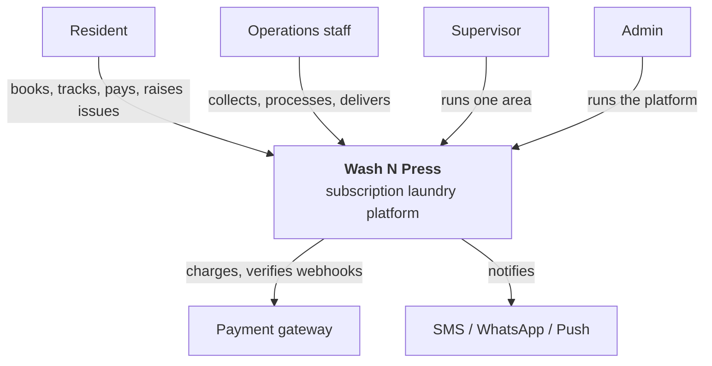
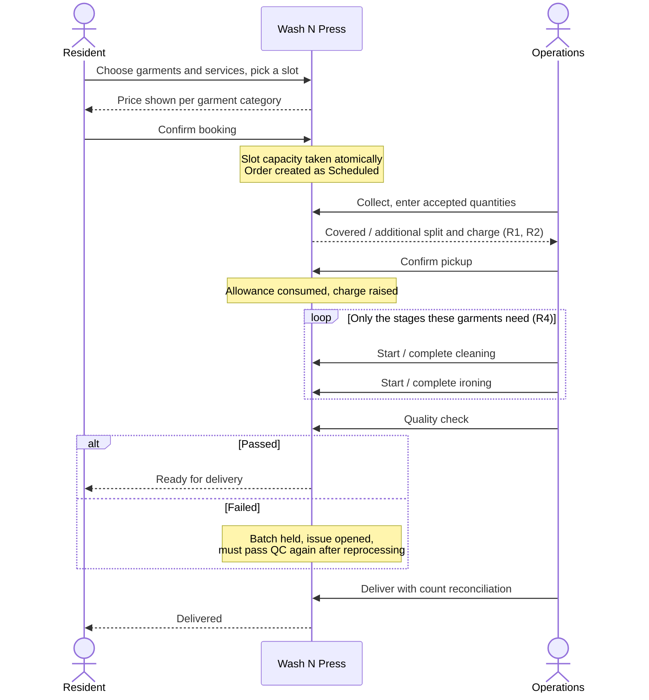
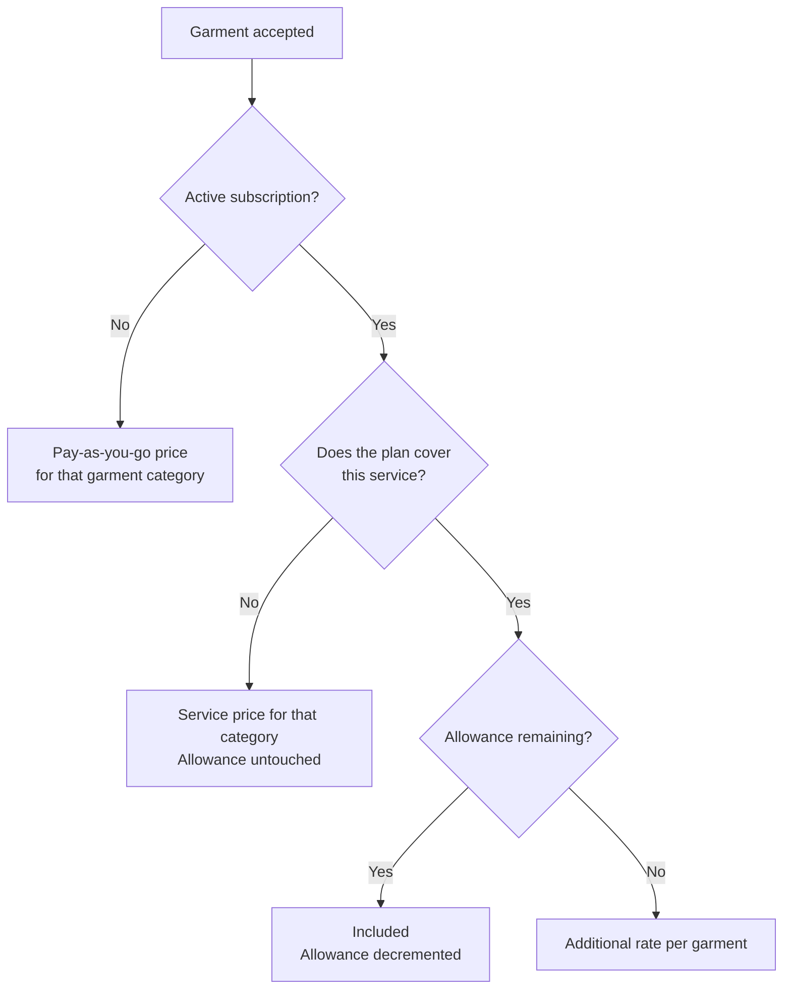
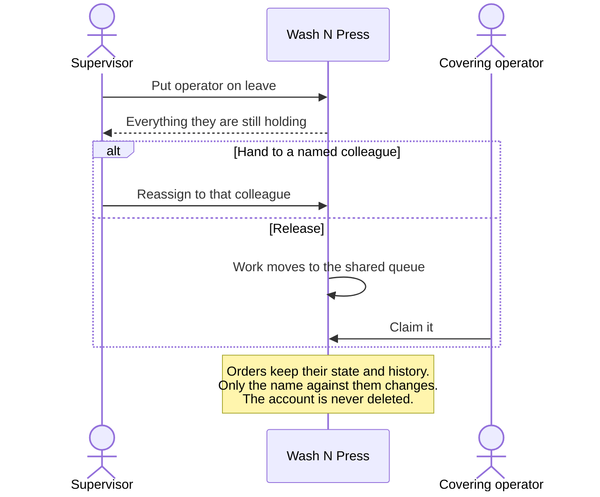

# Wash N Press — System Level Design

| | |
| --- | --- |
| System | Wash N Press — subscription laundry for residential societies |
| Repository | `github.com/Tadipartirohith/WashNPress` |
| Document | System Level Design |
| Companion documents | [HLD.md](HLD.md) — high level design · [LLD.md](LLD.md) — low level design |

---

## 1. Purpose

This document sits between the requirements and the design. It describes **what the
system is, who uses it, what it must do, and how the pieces behave end to end** —
without specifying how any of it is built.

Read this to understand the system. Read the [HLD](HLD.md) to understand its
architecture. Read the [LLD](LLD.md) to understand its internals.

## 2. System context



The platform is the system of record for orders, garment custody, subscriptions and
money. It depends on exactly two external systems: a payment gateway and a
notification provider. Neither is on the critical path of an order — a payment
failure leaves a charge pending, and a notification failure delays a message.

## 3. Actors

| Actor | Who they are | What they may see |
| --- | --- | --- |
| **Resident** | The customer, living in a society | Their own orders, subscription, wallet and tickets |
| **Operations** | Staff who physically handle garments | Orders in the societies they are assigned to |
| **Supervisor** | Responsible for exactly one operational area | Everything inside that area; nothing outside it |
| **Admin** | Runs the platform | Everything, system wide |

### The organisational hierarchy

```
Admin  (system wide)
  └── Area  (exactly one responsible Supervisor, possibly none yet)
        └── Society
              ├── Residents
              └── Operations staff (assigned to one or more societies)
```

Two consequences that matter:

- **An area may exist without a supervisor.** Staff can be created and can work
  before one is assigned. An operator's supervisor is whoever runs their area, so
  assigning one later attaches them automatically.
- **An area outlives its supervisor.** Deactivating a supervisor leaves the
  societies, residents, slots, orders and subscriptions untouched, and the admin
  covers the area in the meantime.

## 4. Capabilities

### 4.1 Resident

| Capability | Notes |
| --- | --- |
| Register and onboard | Name, society, flat, address. Recorded once and never asked again |
| Book a pickup | Choose garments and a service for each part, pick a date from a calendar, see the price of every garment category, confirm |
| Subscribe, or not | A plan is optional. Without one, a resident pays per garment and books normally |
| Change or cancel a plan | Effective next cycle, shown in full, and callable off |
| Track an order | A timeline showing only the stages that order actually goes through |
| Pay | Wallet with top-up; additional charges settled from it |
| Raise and follow a ticket | Question, complaint or dispute; optionally urgent; closed by the resident when satisfied |

### 4.2 Operations

| Capability | Notes |
| --- | --- |
| Pending pickups | Everything still waiting, oldest first, with anything missed on an earlier day badged overdue |
| Garment entry | Enter only the **actual accepted quantity**; the split and the charge are shown before committing |
| Record a pickup exception | Preserved with a reason rather than dropped from the queue |
| Process each garment | Only the stages that order's own garments need |
| Quality check | Pass, or fail with a reason, which holds the batch and opens an issue |
| Deliver | With count reconciliation; a mismatch requires a documented reason |
| Claim unassigned work | Work released by a colleague going on leave, carried on from where it was left |
| Work a ticket | First line for a resident's issue: take it, answer, resolve — or hand it up to the supervisor |
| Raise a ticket | Their own issues go to their supervisor, and stay visible to them wherever they go |

### 4.3 Supervisor

| Capability | Notes |
| --- | --- |
| Area dashboard | The one assigned area, and nothing outside it |
| Society management | Create and edit societies inside their own area |
| Slot management | Create, adjust capacity, cancel — which cancels the bookings and tells those residents |
| Staff management | Create operators, filter by availability, search by name or phone |
| Availability and handover | Put an operator on leave and hand their work to a named colleague or a shared queue |
| Monitoring | Pickups by date and society, processing, QC, delayed orders |
| Support | Second line for the area: reply, prioritise, resolve, or escalate to admin |
| Reports | Area level, over a chosen date range |

### 4.4 Admin

| Capability | Notes |
| --- | --- |
| Dashboard | System wide; every count opens the matching filtered list |
| Areas, supervisors, societies | Create, assign, edit, deactivate |
| Operator management | Create operations staff directly, without a supervisor needing to exist |
| Orders and subscriptions | Across the platform, filterable |
| Plans | Including which services each plan covers |
| Slot monitoring | Utilisation across every area, with the filters to find shortage and waste |
| Revenue | Over a period, narrowed by place or person, broken down five ways |
| Configuration | Garment prices, the service catalogue, categories, defaults, toggles |
| Audit log | Who changed what, with the previous and the new value |

## 5. Core business rules

These are the rules the system exists to enforce. Each is stated once here and
implemented in exactly one place.

| # | Rule |
| --- | --- |
| **R1** | The operator enters only the actual accepted garment quantity. The covered quantity, the additional quantity and the charge are derived by the backend and cannot be supplied by any client |
| **R2** | Subscription usage is finalised at pickup from the accepted quantity, never from the estimate given at booking |
| **R3** | A subscription is optional. A resident without one books normally and pays per garment |
| **R4** | Each garment is processed according to the service it was sent for. Quality check cannot be reached until every stage those garments need is complete |
| **R5** | A plan names the services it covers. A garment sent for a covered service spends allowance and carries no service charge; one sent for a service outside the plan is billed at its own price and leaves the allowance untouched |
| **R6** | Pay-as-you-go pricing and subscription pricing are maintained separately. Changing one never changes the other |
| **R7** | Nobody is a single point of failure. Staff are deactivated rather than deleted; work is handed over or released to a queue; an area survives its supervisor |
| **R8** | A supervisor sees their own area and nothing else. Scope comes from the session, never from the request |
| **R9** | A day that has passed cannot be booked, created or edited. The day ends locally, not in UTC |
| **R10** | Money movements are double-entry and balanced. Payment webhooks are signature-verified and idempotent |

## 6. End-to-end flows

### 6.1 The order lifecycle



### 6.2 What "processing" means for a given order

The lifecycle is the same for everyone — Scheduled, Picked Up, processing, QC, Ready,
Out for Delivery, Delivered. What changes is which processing stages apply:

| Order contains | Stages |
| --- | --- |
| Iron only | Ironing → QC |
| Wash only | Washing → QC |
| Wash and iron | Washing → Ironing → QC |
| Dry clean and iron | Dry cleaning → Ironing → QC |
| A mixture | The union of what its garments need, named after the most specialised cleaning present |

An Iron Only order is never offered a washing action, and the resident's tracking
timeline never shows a washing step that will not happen.

### 6.3 What a resident pays



### 6.4 Staff continuity



### 6.5 Support

An issue carries two facts: **what stage it is at**, and **who has to act next**.

The eight stages — `Open`, `In Progress`, `Waiting for Resident`, `Waiting for
Operator`, `Escalated to Supervisor`, `Escalated to Admin`, `Resolved`, `Closed` —
are enforced by a transition table. Replying to a resolved ticket reopens it; a
closed ticket is final, and reopening means raising a new one.

Who has to act follows from who raised it, and only ever moves upwards:

```
Resident-raised:  Resident → Operator → Supervisor → Admin
Operator-raised:              Operator → Supervisor → Admin
```

Whoever cannot settle it hands it up one rung with a note. The person who raised it
keeps sight of it wherever it goes, and everyone above the current rung can see it —
so an operator follows what their supervisor and the admin say about their own issue,
and the admin can watch anything. Above the admin there is nothing: a further
escalation is refused rather than quietly doing nothing. Emergencies sort to the top.

### 6.6 Processing batches

The unit of work is a **Garment + Service combination**, not a garment type. An order
of two shirts for washing, two shirts for dry cleaning and two trousers for ironing
is three batches, not two garment types.

Each batch carries the sequence its own service needs, and the quantity the operator
actually confirmed. **Batches run alongside each other; the steps inside one run in
order.** An Iron Only batch can be finished and quality checked while a wash batch is
still in the machine, and a batch that fails its check goes back on its own without
disturbing the rest.

The order as a whole is processing while any batch still is, and is ready for
delivery only when every batch has finished and passed.

At pickup the operator confirms each combination separately: what was asked for, what
turned up, and the difference — Matched, Short or Additional. Extra garments are
charged at the rate of the combination they belong to, so an extra dry cleaned shirt
costs what dry cleaning costs. What the resident asked for is never overwritten by
what arrived; both are kept, which is what makes a dispute answerable.

### 6.7 Pickup windows

Pickups run to three fixed windows — Morning 09:00–12:00, Afternoon 13:00–16:00,
Evening 17:00–20:00. The hours belong to the window rather than to whoever created
the slot, so every Morning slot in the network means the same three hours.

A slot must be created at least **two hours** before it starts, so there is time to
roster somebody against it. Booking closes **thirty minutes** before it starts, and a
window that has finished disappears from the list rather than sitting there
un-bookable. All of this is measured on the service day (IST), not in UTC.

## 7. Interfaces

### External

| Interface | Direction | Protocol |
| --- | --- | --- |
| Client applications | Inbound | HTTPS, JSON, bearer token or cookie session |
| Payment gateway | Outbound + webhook | HTTPS; inbound webhook signature-verified and idempotent |
| Notification providers | Outbound | HTTPS via an outbox worker |

### API surface

169 documented operations across 147 paths, grouped by audience:

| Group | Prefix |
| --- | --- |
| Authentication | `/v1/auth/*` |
| Catalogue and pricing | `/v1/plans`, `/v1/services`, `/v1/pricing`, `/v1/societies` |
| Resident | `/v1/resident/*`, `/v1/pickups`, `/v1/orders/*`, `/v1/subscription/*`, `/v1/wallet/*`, `/v1/support/*` |
| Operations | `/v1/operations/*` |
| Supervisor | `/v1/supervisor/*` |
| Admin | `/v1/admin/*` |
| Payments | `/v1/payments/webhook` |
| Operational | `/health`, `/docs`, `/openapi.json` |

A running instance serves Swagger UI at `/docs`, generated from the routes actually
registered — the documentation cannot drift from the implementation.

### Error contract

| Status | Meaning |
| --- | --- |
| `400` | The request was malformed or failed validation |
| `401` | No valid session |
| `403` | Outside the caller's scope, or not permitted for their role |
| `404` | Not found — or outside scope, so that the boundary does not leak existence |
| `409` | A conflict with existing state: duplicate, illegal transition, capacity gone |
| `422` | Well formed, but a business rule refuses it |
| `500` | An unexpected server fault, and nothing a caller could have avoided |

## 8. Data retention

Nothing operational is deleted:

| Entity | On removal |
| --- | --- |
| Staff account | Deactivated; sessions ended; work handed over |
| Slot | Cancelled; bookings cancelled and residents told |
| Garment service | Retired; orders already using it are unaffected |
| Failed pickup | Preserved with its reason; may be rescheduled |
| Order | Never deleted; its timeline is the record of custody |

## 9. Environments

| Environment | Storage | Purpose |
| --- | --- | --- |
| Local (lite) | In-memory | Fastest loop; no external dependency |
| Local (full) | PostgreSQL + Redis | Matches production topology |
| CI | In-memory, plus `pg-mem` for adapter tests | Every push and pull request |
| Production | PostgreSQL + Redis | Container image from GHCR |

The demo seed creates five areas — Madhapur, Gachibowli, Kondapur, KPHB and Manikonda
— three deliberately without a supervisor, so area coverage and creating staff before
a supervisor exists are both demonstrable immediately.

| Role | Demo phone |
| --- | --- |
| Resident | 9876543210 |
| Operations | 9876500002 |
| Supervisor (Madhapur) | 9876500011 |
| Admin | 9876500001 |

## 10. Requirements traceability

Requirements arrived in four rounds. Each is mapped to where it is implemented in
[`washnpress-v2/docs/FEATURES.md`](../washnpress-v2/docs/FEATURES.md), and what
changed in each round is recorded in
[`washnpress-v2/docs/RELEASE_NOTES.md`](../washnpress-v2/docs/RELEASE_NOTES.md),
including reported issues that did **not** reproduce and why.

| Round | Theme |
| --- | --- |
| 1 | Role based portals and the area boundary |
| 2 | Staff continuity, customer support, optional subscriptions |
| 3 | Per-garment processing, per-category pricing, thirteen reported issues |
| 4 | Error contracts, operator ticket handling, slot monitoring, revenue reporting |

## 11. Assumptions and dependencies

**Assumed:**

- One supervisor per area is sufficient; areas are not nested.
- The operation runs in a single timezone per deployment (`serviceDayOffsetMinutes`).
- Residents are identified by mobile number; one number is one account.
- Garment counts are agreed physically at pickup; the system records, not adjudicates.

**Depends on:**

- A payment gateway supporting signed webhooks.
- An SMS or WhatsApp provider for resident notification.
- PostgreSQL 14+ and, for horizontal scale, Redis.

---

*Related: [HLD.md](HLD.md) for architecture · [LLD.md](LLD.md) for module and
algorithm detail.*
